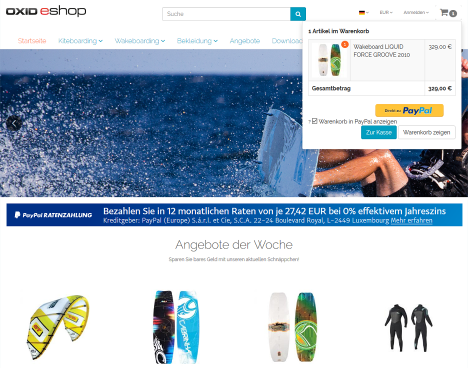

Funktionsbeschreibung
=====================

Bestellungen können im OXID eShop mit PayPal bezahlt werden. Mit PayPal Basis steht im Shop die Zahlungsart PayPal zur Verfügung und kann im Bestellschritt 3 ausgewählt werden. Wurde PayPal Express und der Express Checkout aktiviert, kann der Kunde aus dem Bestellschritt 1, aus dem Bestellschritt 2 sofern noch nicht angemeldet, aus einer Artikel-Detailseite oder aus dem Mini-Warenkorb heraus den Einkauf abschließen. Ratenzahlung ist ein Angebot von PayPal, welches dem Kunden im Shop angezeigt werden kann. Die Ratenzahlung-Banner können auf der Startseite, der Detailseite von Artikeln, den Kategorieseiten, in den Suchergebnissen und/oder im Bestellprozess eingeblendet werden.

Der Shop leitet den Benutzer im Bestellprozess zur PayPal-Zahlungsseite, auf der er sich anmelden muss. Nach Bestätigung der Zahlung wird der Kunde zurück zum Shop geleitet und die Bestellung abgeschlossen.

.. Intern: oxdaad, Status: