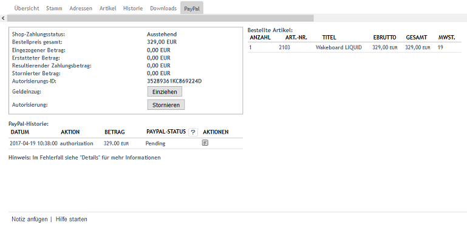

PayPal bei der Bestellung
=========================

Wurden die Artikel mit PayPal bezahlt, werden im Administrationsbereich auf der Registerkarte :guilabel:`PayPal` der Bestellung Zahlungsinformationen, eine PayPal-Historie und eine Übersicht der bestellten Artikel angezeigt.

Die Zahlungsinformationen zeigen den Zahlungsstatus, den gesamten Bestellpreis und Beträge, die eingezogen, storniert oder erstattet wurden.

Ist die Bestellung mit dem zeitverzögerten Einziehen des Betrages (AUTH) verbunden, können bis zu 10 Einzeleinzüge innerhalb von 29 Tagen durchgeführt werden. Somit können Sie flexibel reagieren, wenn beispielsweise zunächst nur Teile der Bestellung geliefert werden können. Wir empfehlen in diesem Fall unmittelbar nach Abschluss der Bestellung und erfolgter Autorisierung einen Einzug auf die erste Teillieferung. Warten Sie dann, bis alle übrigen Artikel der Bestellung lieferbereit sind und ziehen Sie den restlichen Betrag ein.

Mit der Schaltfläche :guilabel:`Einziehen` lassen sich der gesamte Betrag oder Teilbeträge vom Kundenkonto einziehen. Der Vorgang kann mit einem Kommentar dokumentiert werden.

Eine erteilte Autorisierung zum Geldeinzug kann storniert und ein Zahlungsstatus gesetzt werden. Der Zahlungsstatus kann "Abgeschlossen", "Ausstehend" oder "Abgebrochen" sein. Auch hier ist es möglich, beispielsweise den Grund der Stornierung in einem Kommentar festzuhalten.

In der :guilabel:`PayPal-Historie` werden alle Transaktionen in einer tabellarischen Übersicht angezeigt. Für jede Transaktion, wie Autorisierung, Einzug, Erstattung oder Stornierung, wird eine Tabellenzeile angelegt, an deren Ende über eine kleine Schaltfläche Details aufgerufen werden können. Die Tabellenzeilen für den Einzug eines Betrages haben eine weitere Schaltfläche, um Erstattungen vornehmen zu können. Somit ist eine genaue Zuordnung der Erstattung zu einem eingezogenen Betrag möglich.

Eine weitere tabellarische Übersicht auf der Registerkarte listet alle bestellten Artikel mit Anzahl, Artikel-nummer, Titel, Preis und Mehrwertsteuer auf.

.. Intern: oxdaaf, Status: