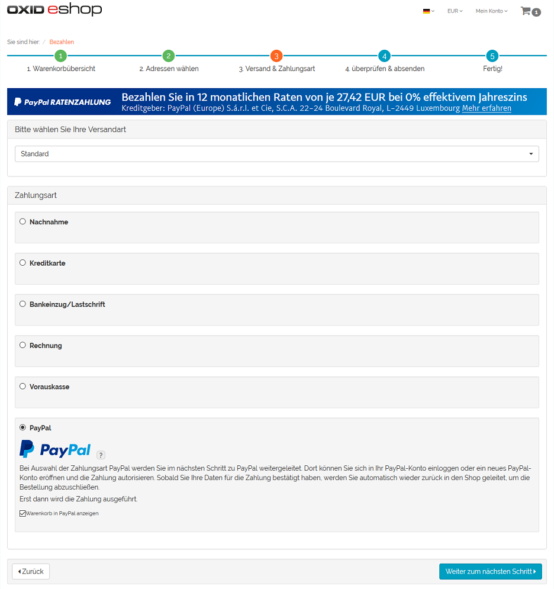
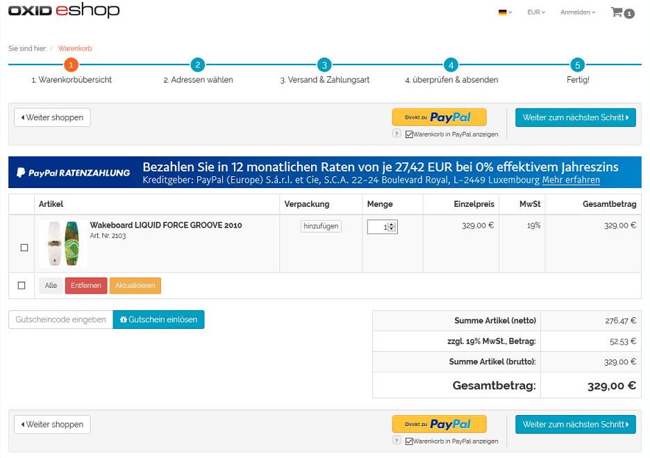
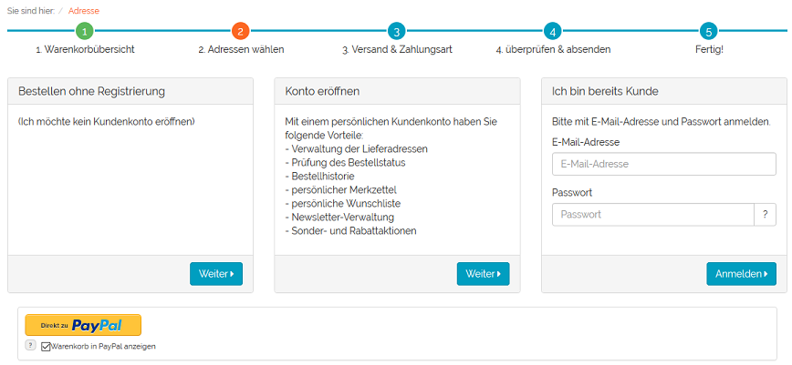
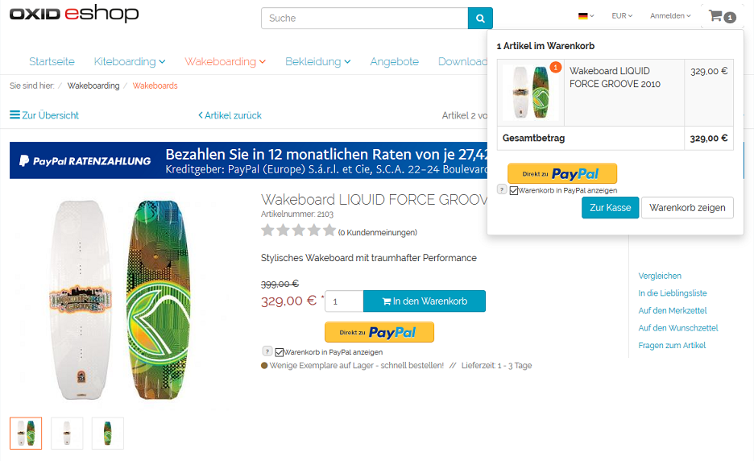
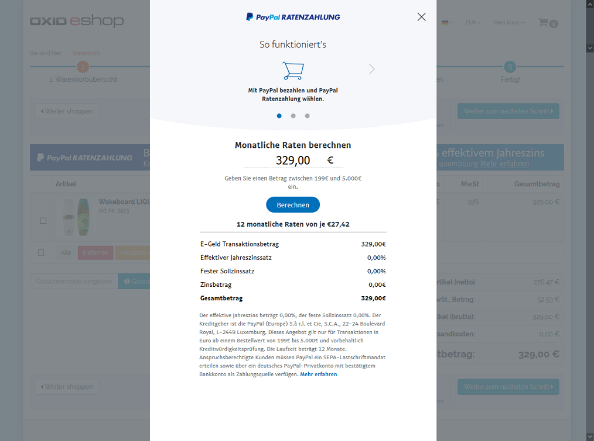
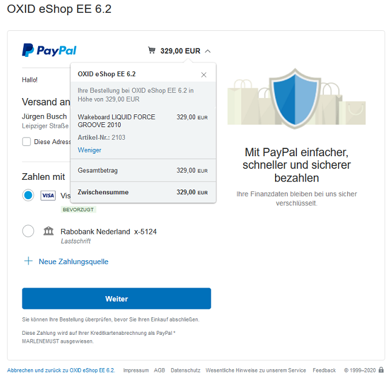

PayPal im Bestellprozess
========================

Mit PayPal Basis lässt sich die Zahlungsart PayPal im Bestellschritt 3 auswählen. Der Benutzer ist zu diesem Zeitpunkt bereits im Shop angemeldet oder kauft ohne Registrierung ein. In beiden Fällen hat er seine Adressdaten bereits eingegeben, wenn er zur PayPal-Zahlungsseite gelangt.

Bei Bestellung mit PayPal Express kann der Kunde aus dem Bestellschritt 1, aus dem Bestellschritt 2 sofern noch nicht angemeldet, aus einer Artikel-Detailseite oder aus dem Mini-Warenkorb heraus den Einkauf abschließen.

|br|

|br|

|br|
PayPal bietet seinen Kunden die Ratenzahlung über 12 Monate bei einem Bestellwert von 199 € bis 5.000 € an. Auf diese Finanzierung kann im Shop mit Bannern aufmerksam gemacht werden. Sie können auf der Startseite, der Detailseite von Artikeln, den Kategorieseiten, in den Suchergebnissen und/oder im Bestellprozess eingeblendet werden. Die aktuellen Bedingungen und Konditionen der Ratenzahlung, die von PayPal automatisch aktualisiert werden, lassen sich über den Link :guilabel:`Mehr erfahren` aufrufen und werden in einem Detailfenster angezeigt.

|br|
Der Shop leitet den Benutzer jeweils zur PayPal-Zahlungsseite. Je nach Konfiguration und Kundenentscheidung werden die Artikel der Bestellung auf der PayPal-Zahlungsseite angezeigt.

.. hint::  Befinden Sich Artikel in nicht ganzzahliger Menge (z.B. 1,5) im Warenkorb, wird der Warenkorb niemals in PayPal angezeigt, auch wenn diese Option im Bestellprozess aktiviert wurde.

Der Kunde kann sich nun an sein PayPal-Konto anmelden oder ein neues erstellen. Nach Bestätigung der Zahlung wird der Kunde zurück zum Shop geleitet. Im Falle des Express-Kaufs werden dabei auch die Kundendaten aus dem PayPal-Konto an den Shop übergeben. Damit entfällt das Ausfüllen des Formulars im Bestellschritt 2. Da auch die Versandart auf der PayPal-Zahlungsseite gewählt werden kann, wird direkt Bestellschritt 4 aufgerufen.

Nach Abschluss der Bestellung findet die Bezahlung statt. Abhängig von der Konfiguration wird der Betrag zwischen den PayPal-Konten sofort gebucht oder es erfolgt eine Autorisierung der Zahlung. Der autorisierte Betrag wird zu einem späteren Zeitpunkt manuell eingezogen.

.. Intern: oxdaae, Status: