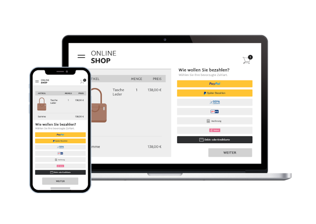

Module Documentation
====================

.. image:: media/paypal-logo.png
    :alt: PayPal-Logo
    :class: no-shadow
    :height: 38
    :width: 150

.. toctree::
   :maxdepth: 1
   :caption: PayPal Checkout

   For what?/Where not? <introduction>
   Installation <installation>
   Configuration <configuration>
   Changelog (GitHub) ➜ <https://github.com/OXID-eSales/paypal-module/blob/v2.2.3/CHANGELOG.md>

.. image:: media/icons/home.png
   :width: 0 px
   :height: 0 px